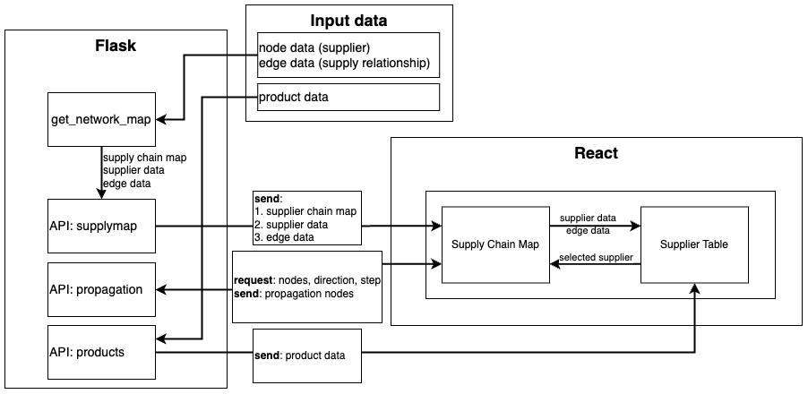

# SCM

## 程序架构

### 前端
负责各组件的布局和图像渲染

### 后端
负责绘制bokeh图像传给前端，向前端提供数据

## TODO

1. 设计一个选择共享机制，在图中可以直接选择点，在表格中可以直接选择行，对应的索引可以反映在图像上，但是在图中选择点并不会反映在表格上。此外，在表格中选择的行索引在取消后也不会反映在图中，及添加动作同步，删除动作不同步。因此，需要设计一个共享/同步机制。

2. 在后端绘制分层网络图，在前端渲染出来。

3. 企业数据处理、读入问题。如何从企业数据处理得到程序的输入，企业数据不包含供应商的经纬度。

4. 目前上下游供应链的实现在逻辑上还存在问题

## 数据模型

### 1. SupplyChain 数据模型
| **字段名称**          | **数据类型**              | **是否必填** |
|-----------------------|---------------------------|--------------|
| id                    | db.Integer               | 是           |
| name                  | db.String(80)            | 是           |
| created_at            | db.DateTime              | 是（默认当前时间） |
| updated_at            | db.DateTime              | 是（默认更新时的时间） |
| nodes                 | db.Integer              | 是，默认为0  |
| edges                 | db.Integer              | 是，默认为0  |
| has_latlon           | db.Boolean               | 是，默认为False |
| has_layer            | db.Boolean               | 是，默认为False |

### 2. Node 数据模型
| **字段名称**          | **数据类型**              | **是否必填** |
|-----------------------|---------------------------|--------------|
| id                    | db.Integer               | 是           |
| node_id               | db.String(64)            | 是           |
| name                  | db.String(128)           | 是           |
| properties            | db.JSON                   | 否           |
| supply_chain_id      | db.Integer               | 是（外键）   |

### 3. Edge 数据模型
| **字段名称**          | **数据类型**              | **是否必填** |
|-----------------------|---------------------------|--------------|
| id                    | db.Integer               | 是           |
| edge_id               | db.String(64)            | 是           |
| source_id             | db.String(64)            | 是           |
| target_id             | db.String(64)            | 是           |
| properties            | db.JSON                   | 否           |
| supply_chain_id      | db.Integer               | 是（外键）   |

---

1. 节点
- `nodeID`，节点ID，必需
- `name`，节点名称，必需
- `tier`，节点层级，非必需
    - 有`tier`属性可以绘制分层网络图
    - 没有`tier`属性绘制普通的网络图
- `longitude`，经度，非必需
- `latitude`，维度，非必需
    - 有经纬度绘制供应链地图
    - 没有经纬度则不绘制
- 其他

2. 边
- `edgeID`，边ID，必需
- `start`，起始节点ID，必需
- `end`，末尾节点ID，必需
- 其他

### 数据管理
1. 文件上传
    - 选择供应商信息文件；
        - 检查文件是否符合数据模型
    - 选择供应关系信息文件；
        - 检查文件是否符合数据模型
    - 检测供应商数据和供应关系数据合法
2. 创建供应链数据表
    - 设置供应链名称
    - 确认新建供应链数据表
    

## 图景可视化

### 网络图
- 使用必需的数据，可以绘制最基本的网络图
    - 如果包含每一个点的层级，可以绘制分层网络图

### 供应链地图
- 如果包含每一个点的地理位置，可以绘制供应链地图
