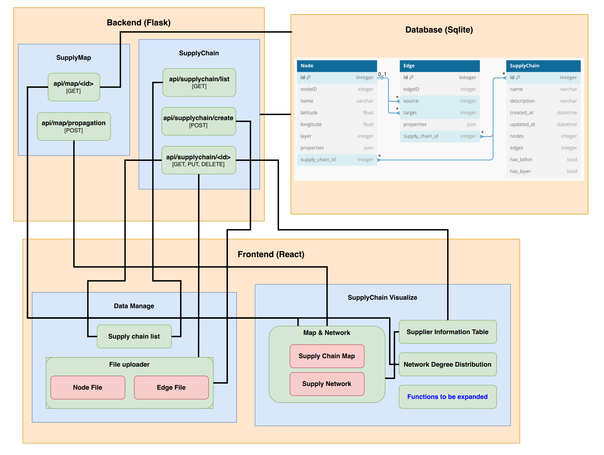

# SCM

## Run it
### 1. Get the code

First, you need to get the code for this project from the Git repository. Please follow the steps below:

#### 1.1 Clone the project code

If you have not installed Git yet, please download and install Git from the Git official website.

Use the following command to clone the project code:

``` sh
git clone https://github.com/zhaohongbo02/scm.git
```

#### 1.2 Enter the project directory

After cloning successfully, enter the project directory:
``` sh
cd scm
```

### 2. Configure Python virtual environment (Python 3.8 or 3.9)

To ensure that project dependencies are isolated from the system environment and use a specific version of Python (<b>next take 3.8 as an example, and the same for 3.9</b>), you can choose the following two ways to configure the Python virtual environment:

#### 2.1 Create a virtual environment with Python 3.8 (recommended)

If you already have conda or prefer to use conda, see [2.2 Create a Python 3.8 virtual environment using Conda](#conda).

If your system already has Python 3.8 installed, you can create a virtual environment by following the steps below:

1. Install Python 3.8

- Linux (Ubuntu/Debian):
``` sh
sudo apt-get install python3.8
```
- macOS (via Homebrew):
``` sh
brew install python@3.8
```
- Windows: Download and install directly from the official Python website.

2. Create a Python 3.8 virtual environment

After the installation is complete, you can use the following command to create a Python 3.8 virtual environment:

- Linux/macOS:
``` sh
python3.8 -m venv venv
```
- Windows:
``` sh
python3.8 -m venv venv
```
If the python3.8 command is not available in Windows, you can try using the py command:
``` sh
py -3.8 -m venv venv
```
3. Activate the virtual environment

After creating the virtual environment, you need to activate it:

- Linux/macOS:
```
source venv/bin/activate
```
- Windows:
``` sh
.\venv\Scripts\activate
```
4. Verify the Python version

After activating the virtual environment, check the Python version to make sure it is 3.8:
``` sh
python --version
```

If it shows `Python 3.8.x`, it means that you have successfully created and activated a virtual environment based on Python 3.8.

#### [2.2 Create a Python 3.8 virtual environment using Conda](#conda)

If you are using Conda, you can create a Python 3.8 virtual environment by following these steps:

1. Install Conda

If you don't have Conda installed yet, you can install Conda through Anaconda or Miniconda.

2. Create a Conda environment

To create a Conda environment for Python 3.8, use the following command:
```sh
conda create -n myenv python=3.8
```
`myenv` is the name you want to give your virtual environment, which can be changed as needed.

3. Activate the Conda environment

After creating the virtual environment in Conda, activate it:
``` sh
conda activate myenv
```
4. Verify the Python version

Similarly, after activating the virtual environment, verify the Python version using the following command:
``` sh
python --version
```
If it shows `Python 3.8.x`, the Python version in the Conda environment has been successfully set to 3.8.

#### 2.3 Install dependencies

After the virtual environment is activated, use the requirements.txt file to install all project dependencies:

``` sh
pip install -r requirements.txt
```

This will install the libraries required by the project based on all the dependencies listed in requirements.txt.

### 3. Start the program

Once the program is configured, you can start the project with the following steps.

#### 3.1 Start the project

``` sh
cd backend
flask run
```

#### 3.2 Access the application

After starting, by default, you can view the application by accessing the following address through the browser:

http://127.0.0.1:5000/

### 4. Stop the program

If you need to stop the running program, you can press Ctrl + C in the command line to terminate the process.

## Program Framework


## Data Models

### 1. SupplyChain
| **Field Name**          | **Data Type**              | **Required** |
|-----------------------|---------------------------|--------------|
| id                    | db.Integer               | YES (Primary Key)|
| name                  | db.String(80)            | YES           |
| created_at            | db.DateTime              | YES (Default current time)|
| updated_at            | db.DateTime              | YES（Default update time） |
| nodes                 | db.Integer              | YES (Default is 0)|
| edges                 | db.Integer              | YES (Default is 0)|
| has_latlon           | db.Boolean               | YES (Default is False)|
| has_layer            | db.Boolean               | YES (Default is False)|

### 2. Node
| **Field Name**          | **Data Type**              | **Required** |
|-----------------------|---------------------------|--------------|
| id                    | db.Integer               | YES (Primary Key)|
| node_id               | db.String(64)            | YES           |
| name                  | db.String(128)           | YES           |
| properties            | db.JSON                   | NO           |
| supply_chain_id      | db.Integer               | YES (Foreign key)  |


### 3. Edge
| **Field Name**          | **Data Type**              | **Required** |
|-----------------------|---------------------------|--------------|
| id                    | db.Integer               | YES (Primary Key)|
| edge_id               | db.Integer            | YES           |
| source_id             | db.Integer            | YES           |
| target_id             | db.Integer            | YES           |
| properties            | db.JSON               | NO           |
| supply_chain_id      | db.Integer             | YES (Foreign key) |